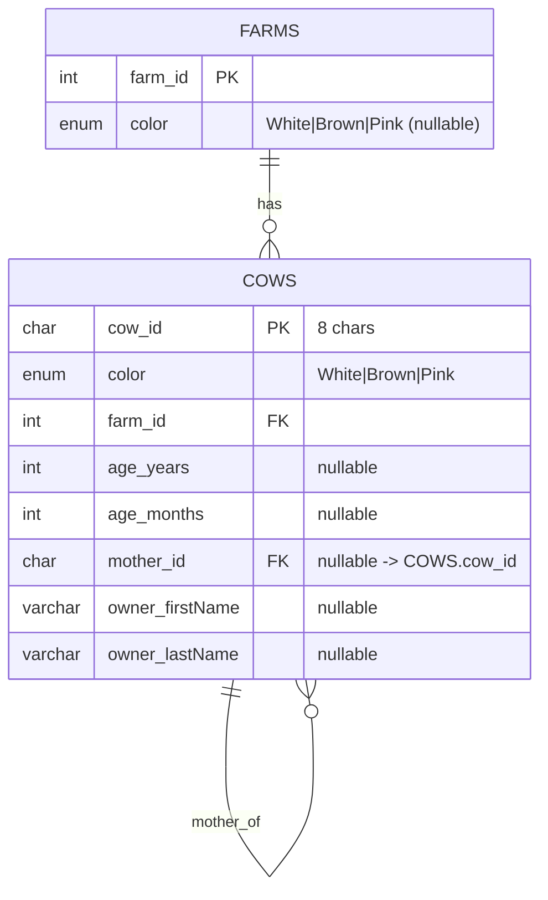
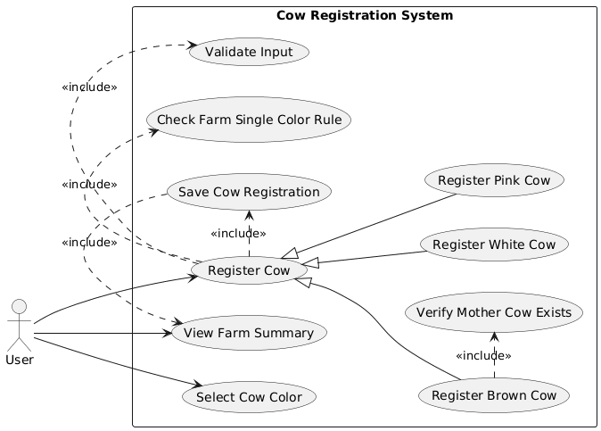

# Cow register


- เลือกสีวัว (White/Brown/Pink) แล้วเปิดหน้าลงทะเบียนแยก View ตามสี  
- ตรวจสอบ input ตามเงื่อนไขของแต่ละสี  
- ฟาร์ม 1 แห่งรับวัวได้ “สีเดียว” เท่านั้น  
- ลงทะเบียนเสร็จ แสดง “จำนวนวัวและสีของวัวในแต่ละฟาร์ม” แล้วกลับหน้าแรกได้

## Tech Stack

- Backend : Node.js
- Frontend : EJS, HTML, CSS
- Web Service : Express.js
- Database : MySQL
- Testing : Postman


## Project Structure

```
cow-register-mvc/
├── config/
│   └── db.js     
├── controllers/
│   └── cowController.js  
├── models/
│   ├── cowModel.js        
│   └── farmModel.js  
├── routes/
│   ├── api.js
│   └── web.js
├── routes/
│   ├── schema.sql
│   └── seed.sql
├── views/
│   ├── paritials/
│   │   ├── footer.ejs   
│   │   └── header.ejs   
│   ├── register_brown.ejs
│   ├── register_pink.ejs
│   ├── register_white.ejs
│   └── summary.ejs
├── README.md               
└── app.js           
```


## ER Diagram




## Use cases diagram

